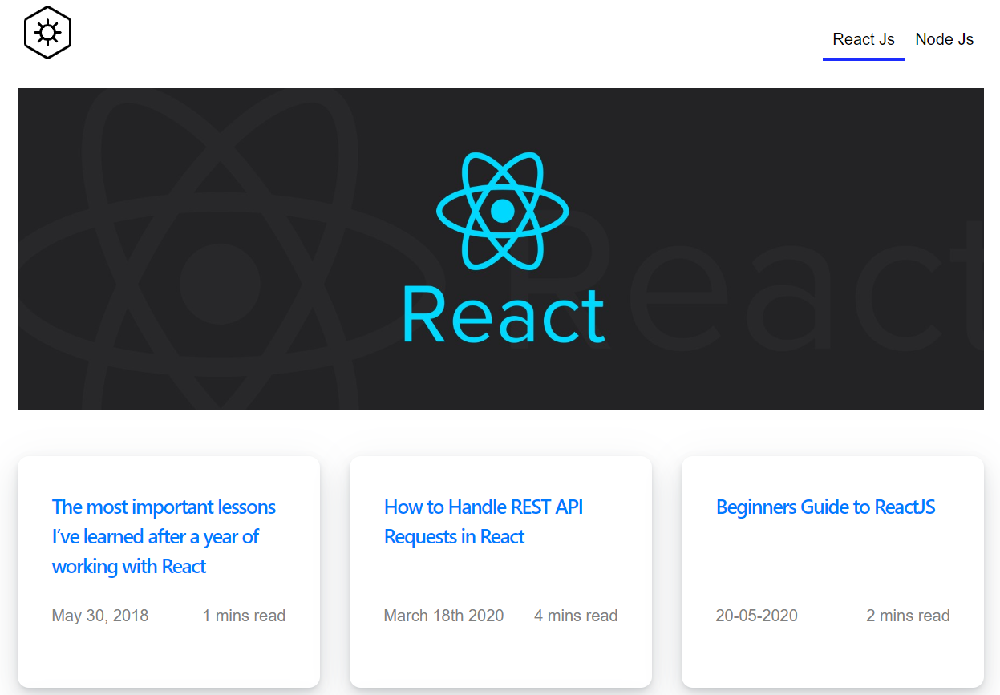

Gatsby Blog  
============
Demo : https://gatsby-rn-blog.netlify.app/

Gatsby blog is using `gatsby-transformer-remark` to render markdown files

#### Topics covered
1. How to add `gatsby-transformer-remark` plugin to the app 
2. How to render markdown files using the plugin
3. How to create a slug for an every article (using `onCreateNode()` gatsby-node api)
4. How to programatically create a page (using `createPages()` gatsby-node api)
5. How to query using graphql
